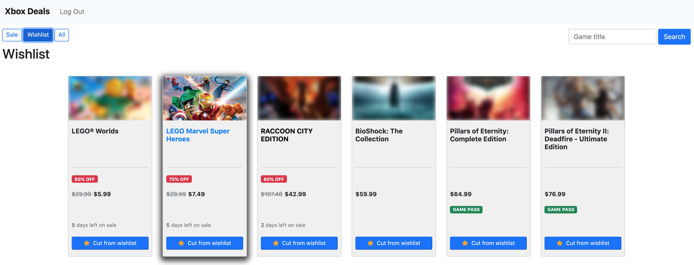

# wishlist
**wishlist** - A CS50x Web Capstone Project https://cs50.harvard.edu/web/2020/projects/final/capstone/



[Demo video](https://www.youtube.com/watch?v=cWoVgECtFpQ)


# Table of Contents
- [Overview](#overview)
- [Details, Details](#details-details)
- [The User Experience](#the-user-experience)
- [How It Works](#how-it-works)
- [Set Up Instructions](#set-up-instructions)
- [Lessons Learned](#lessons-learned)
- [File Descriptions](#file-descriptions)


## Overview
*wishlist* was inspired by some anti-consumer moves both Microsoft and Sony have made
recently. In 2020, both Sony and Microsoft removed all wishlist functionality from
their respective online videogame stores. Wishlists were handy for a few reasons. First, it let users
compile a list of games they were generally interested in. Second, if the games were
on sale, that was often reflected in the wishlist. This provided a nice way for users
to filter through the massive stores and really focus on games they were interested in,
and perhaps purchase them at a price they agreed with. *wishlist* was heavily inspired
by the site [DekuDeals](https://www.dekudeals.com/), which shares much of the same
functionality, but focuses on Nintendo Switch games.

*wishlist* is a web application that tracks game prices from the [Canadian Xbox Game Store](https://www.xbox.com/en-CA/games/all-games?xr=shellnav)
and allows users to add or remove games from their own personal wishlist. This allows users
to see at a glance which games they are interested in are on sale, the context of that sale
(E.g. an Xbox Live Gold members-only sale or a general sale), and how long the sale may be running
(if that information is made available). *wishlist* also tracks game price history, so users
can see past sale prices and dates, which may inform their purchasing decision.

Why the Canadian Xbox Game Store specifically? Well, I'm Canadian, and it was easiest
to work with for me. It could fully support the US-based store, they don't seem all
that different; but it was hard for me to test with the US store since it always wanted
to redirect me to the Canadian store. One update that would be required to support different
locals and currencies would be multicurrency, which seemed like a bit too much of an
undertaking for this project.


## Details, Details
*wishlist's* back-end was written in Python using the Django library, and the front-end
was mainly written in Javascript, and does not make much use of Django's templates. While
Django's templates may have simplified things, I was really enamoured with the
idea of a single-page site that doesn't redirect or reload between routes. I also wanted
more practice working in Javascript, and after this exercise see the appeal of tools
like React that do not require DOM manipulation. Javascript fetch requests are used
to communicate with the back-end, which means the back-end is almost operating like
an API, just passing JSON messages back and forth. I thought that might help future-proof
it in some ways, since the back-end and front-end are completely decoupled.

The data for *wishlist* comes from two primary sources: The Canadian Xbox Game Store,
and the [Giant Bomb API](https://www.giantbomb.com/api/). Giant Bomb is a site dedicated to videogames,
and has perhaps the largest crowd-sourced wiki on video games outside of Wikipedia itself.
The API is free and easy to work worth. Currently, while *wishlist* is pulling in a data items
from the Giant Bomb API, it's currently only making use of the images.


## The User Experience
When a user visits *wishlist*, they will be presented with the games on sale view (assuming
there are games already loaded into the system; there is a seeder management command if needed,
more on that in the setup instructions). From there, visitors can navigate to the wishlist view,
which will redirect them to the login view as they not logged in, or the all-games view. These three
views (sale-games, wishlist-games, all-games) make up the backbone of the application.

Users can click on a specific game card in each view to drill into the game details, which includes
a price history (if available). Each game card in each view include an Add or Remove from wishlist
button users can click to add or remove the game to or from their personal wishlist. Note that
non-logged in visitors will be redirected to the login view when they click this button.

Finally, there is a general search feature, which will perform a general title match
on the search term and return any matching results. However, if no results are found,
the user will be shown an add-game form which takes one value: a URL from the Canadian Xbox Game Store.
Upon submission, the user will be shown the game entry within the application.


## How It Works
When the user submits a URL, it is validated to ensure that is a URL for the Canadian Xbox Game Store,
to the best of my ability. Then the back-end will use a combination of the _requests_ and 
_beautifulsoup4_ libraries to retrieve the game store page and parse out the relevant details: the
game's title, current price, regular price if available, if it's on sale, the type of sale,
how many days left on the sale (if available), and if the game is free on Microsoft's Game Pass service.

From there, a request is made to the Giant Bomb API to get an image for the game, and some other
details. The entries are then stored in the database.

Scraping the store game and requesting the data from the Giant Bomb API is a fairly slow process, but
luckily, aside from when adding a game, the user should never experience that, and as user's build up
the database, that should be required less and less.

However, that left me with a problem: I have to frequently scrape the game page to get the
latest attributes for each game. Luckily, they do no change minute-to-minute or even hour-to-hour,
so I settled on running a task in the background every eight hours to update every game in the
system (if there was anything to update). This was implemented with a simple Django management
command (so it can also be ran from the command line), and registered as a cron using the 
_kronos_ library.

For each multigame view (sale-games, wishlist-games, and all-games), pagination has been implemented.
As I was not using Django templates, and because I was using plain Django instead of what would
have been the perhaps more appropriate Django Rest Framework, I had to write my own paginator
for serialized responses.


## Set Up Instructions

_Note_: All commands listed below are intended to be run in the terminal, not the Python shell

1. (_Optional_) Create the virtual environment of your choice. This application was built with Python 3.8.5,
so I recomment using a combination of [_pyenv_](https://github.com/pyenv/pyenv) and the virtual environment
manager in the standard library:

```
$> mkdir py385 && cd py385
$> pyenv install 3.8.5
$> pyenv local 3.8.5
$> python -m venv . --copies
$> source bin/activate
```

2. Go to the [Giant Bomb API page](https://www.giantbomb.com/api/), register for an account, and copy the API key

3. Add the Giant Bomb API key as an environment variable in your virtual environment:

```
$> export GIANTBOMB_API_KEY=<your api key>
```

4. Clone this repo

```
$> git clone git@github.com:tomwhross/wishlist.git
$> cd wishlist
```

5. Install the requirements

```
$> pip install -r requirements.txt
```

6. (_Optional_) Install the recommended development libraries (pylint, black, pdbpp, etc.)

```
$> pip install -r dev_requirements.txt
```

7. Make and run migrations

```
$> python manage.py makemigrations
$> python manage.py migrate
```

8. (_Optional_) Seed the database with a select number of games

```
$> python manage.py seed_games
```

9. (_Recommended_) Register the cron job to update games in the background every 8 hours

```
$> python manage.py installtasks
```

10. Run the server! By default it will run at http://127.0.0.1:8000/

```
$> python manage.py runserver
```


## Lessons Learned

The largest lesson I think I learned from this exercise is that while not relying on Django's templates
to generate the HTML content can make for a neat user experience, it probably wasn't the best approach for
this project. First, I had to write a bunch for fetch requests to communicate with the back-end that
I otherwise wouldn't have had to write - aside from the add/remove to wishlist button status. Second,
I had to write my own paginator for serialized responses since the Django paginator is expected to work
with native querysets; this took up an incredibly amount of my time, while I know from experience that 
implementing the Django paginator is trivial. Third, single-page sites, while novel, are a pain to work
with for any significant amount of time, as you can't just copy URLs/routes to retry, you constantly
have to manually navigate through the site to get where you want to be (there might be a way to do this in
a single page site by updating the URL behind the scenes). On top of that, manually manipulating the DOM
to create, show, and hide or destory elements is time consuming. It also made me realize how powerful
and convenient React can be.

The largest amount of time on this site was spent on two thnings: Designing the front-end UI, and testing via
the front-end. I am familar with Python unittests, Django's implementation of them somewhat, and with Selenium
for front-end testing, I did not end up implementing any of them due to a lack of time. However, what I should
have done was written the tests very early. I know TDD prescribes writing all the tests up front, but as I was
very unfamilar with some of the modules I was working with and exactly how I would be using them, that would have been
difficult. However, if I'd started writing tests 50% of the way through the project, I probably could have saved
a tonne of time that was later spent on manual testing. Designing the front-end UI would have been a much harder
task to find time-savings within. I spent a lot of time asking others what they thought of the UI and making changes
based on their feedback. It felt realistic, but also slow and frustrating at times. This is an area I'd
have to dig into further.

Next, web scraping is tough and unpredicable, and often thwarted. One of the biggest surprises I found while trying to
scrape pages from the Xbox Store was that divs that contained vital information would randomly change their 
identifers throughout the day, for no discernable reason. The content within the div wouldn't change (e.g. the
price wouldn't change), but hour to hour the ID attribute value would be different. It seems this was done
entirely to thwart web scrapers. Luckily for me, the ID changed with a sequential number, and always stayed under
a fairly low ceiling, so it was something I could work around.


## File Descriptions

| File                           | Description                                                                                                |
| ------------------------------ | ---------------------------------------------------------------------------------------------------------- |
| `./requirements.txt`             | External libraries this application is dependent upon                                                    |
| `./requirements_dev.txt`         | Optional development libraries                                                                           |
| `./README.md`                    | This file                                                                                                |
| `./wishlist/settings.py`         | Application settings and registration                                                                    |
| `./wishlist/urls.py`             | App-wide route registration                                                                              |
| `./xbox/admin.py`                | Model registration for admin console                                                                     |
| `./xbox/apps.py`                 | Application registration                                                                                 |
| `./xbox/constants.py`            | Application-wide constants                                                                               |
| `./xbox/models.py`               | Application ORM models, contains User, Game, GameDetails, GamePriceHistory models                        |
| `./xbox/urls.py`                 | Application route registration                                                                           |
| `./xbox/util.py`                 | Custom helper functions, contains the scraper logic                                                      |
| `./xbox/views.py`                | Views to take requests and render JSON responses to the front-end                                        |
| `./xbox/management/commands/seed_games.py`      | Command to insert an initial collection of games into a the database                      |
| `./xbox/management/commands/update_games.py`    | Command to update selected or all game data, can be registered as a cron                  |
| `./xbox/templates/xbox/layout.html` | Generate layout, baically just the navbar                                                             |
| `./xobx/templates/xbox/index.html`  | All other HTML views, including games-views, game-view, search, add-game, login, and register         |
| `./xbox/static/xbox/index.js`       | Contains all the custom Javascript that powers the site                                               |
| `./xbox/static/xbox/styles.css`     | Contains all custom CSS styling                                                                       |
